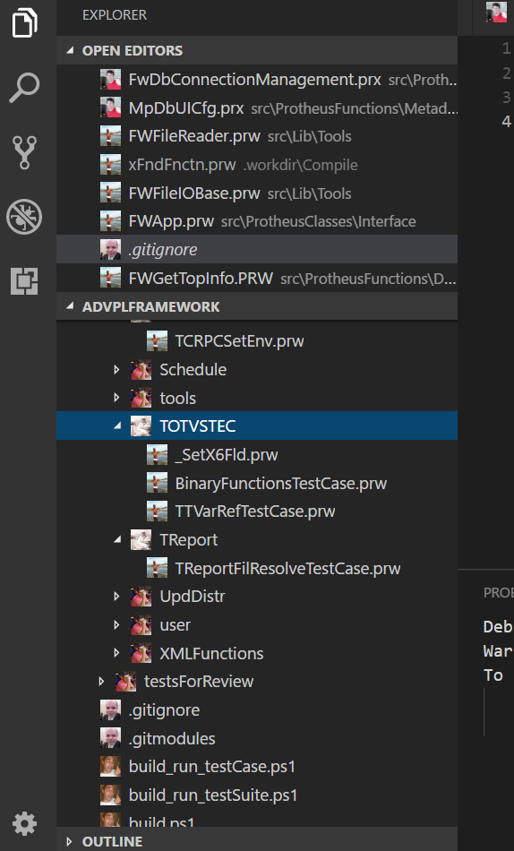

# Frame Icons

## Installation

To install the extension just execute the following command:

```sh
ext install frame-icons
```

## Usage
* `Linux` & `Windows` > **File > Preferences > File Icon Theme > Frame Icons**.
* `MacOS` > **Code > Preferences > File Icon Theme > Frame Icons**.

## Example

